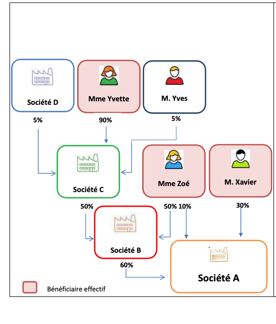

# Projet: API  pour retrouver les benecifiaires des entreprises

## Versions utilisées

- **Java** : 21
- **Spring Boot** : v3.4.0
- **Librairies** :
    - AssertJ: v3.26.0
    - jakarta: 3.0.2


## Structure du projet

Ce projet est conçu selon les principes de la **Clean Architecture**. Cela garantit une séparation claire des responsabilités et une facilité de maintenance. En cas de migration future vers Quarkus, cette structure permettra une adaptation rapide et sans heurts.

## Lancer le projet

### Prérequis

Avant de lancer l'application, assurez-vous d'avoir installé Docker et Docker Compose sur votre machine.

### Exécution

Pour démarrer le projet, exécutez la commande suivante dans le répertoire du projet :

```bash
docker-compose up
```
## Jeux de données en mémoire pour faire les tests:
En mémoire, nous avons une liste de sociétés représentées comme suit :
- **Sociéte A** : id = 1
- **Sociéte B** : id = 2
- **Sociéte C** : id = 4
- **Sociéte D** : id = 3

Nous avons une structure de données représentée dans l'image ci-dessous.:



## contract API

### 1. Récupérer les bénéficiaires

**Méthode** : `GET`  
**URL** : `/beneficiaire`  
**Description** : Récupère la liste des bénéficiaires en fonction de l'identifiant de la société et du scope spécifié.
**Résultas** : [{nom: string, part: string}]

#### Paramètres de la requête :
- **societeId** *(obligatoire)* : L'ID de la société pour laquelle récupérer les bénéficiaires.
- **scope** *(obligatoire)* : Le scope de la récupération des bénéficiaires. Peut prendre l'une des valeurs suivantes :
  - `ALL` : Récupère tous les bénéficiaires.
  - `PERSONNE_PHYSIQUE` : Récupère uniquement les personnes physiques.
  - `BENEFICIAIRE_EFFECTIFS` : Récupère uniquement les bénéficiaires effectifs.
#### Exemple de requête :
```http
GET https://<host>/beneficiaire?societeId=1&scope=ALL
```
#### Codes d'état HTTP
- **200 OK** : La requête a été traitée avec succès et la réponse contient la liste des bénéficiaires avec leurs parts respectives.
- **204 No Content** : Aucun bénéficiaire n'a été trouvé pour la société spécifiée, mais la requête a été traitée avec succès.
- **404 Not Found** : L'ID de la société fourni ne correspond à aucune entreprise dans la base de données.
- **406 Not Acceptable** : La valeur du paramètre scope ne respecte pas les valeurs autorisées (doit être ALL, PERSONNE_PHYSIQUE, ou BENEFICIAIRE_EFFECTIFS).
